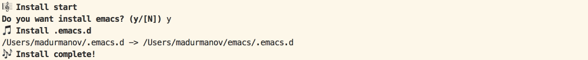

# musical-install

musical-install is shell library of helper functions for create install files with use musical emojis.

## Functions

- mi_start (print start emoji) - :musical_score:
- mi_step (print step emoji) - :musical_note:
- mi_complete (print complete emoji) - :notes:
- mi_confirm (confirm actions by answer yes or no)
- mi_install (create symbol links from to)

## Usage

```shell
#!/bin/bash

eval "$(curl -sL https://raw.githubusercontent.com/madurmanov/musical-install/master/musical-install.sh)"

mi_start

if mi_confirm "Do you want install emacs" ; then
  mi_install .emacs.d $HOME
fi

mi_complete
```


## Wishes

Make music guys by automating your work environment with fun.

## License

**musical-install** is released under the MIT License. See the bundled `LICENSE.md` for details.
